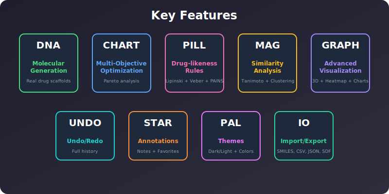
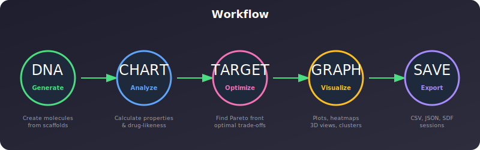
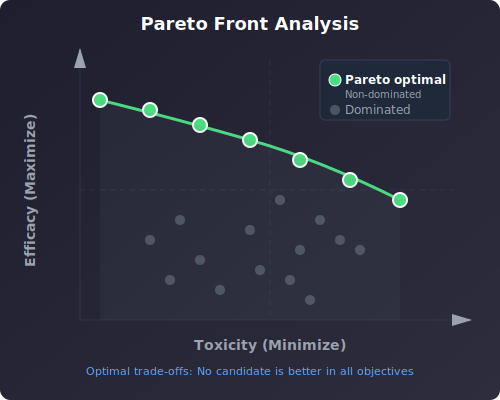
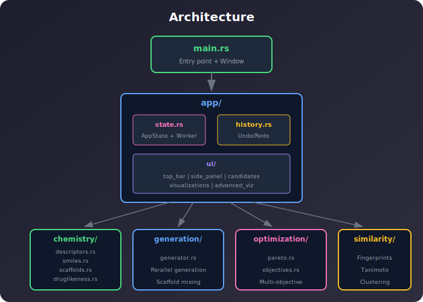

<p align="center">
  
</p>

<h1 align="center">💊 Drug Candidate Studio</h1>

<p align="center">
  <strong>A native Rust desktop application for computational drug discovery</strong><br>
  Molecular generation • Multi-objective optimization • Interactive visualization
</p>

<p align="center">
  
  
  
  
</p>

---

## ✨ Key Features

<p align="center">
  
</p>

| Feature | Description |
|---------|-------------|
| 🧬 **Molecular Generation** | Generate drug-like molecules from 30+ real pharmaceutical scaffolds |
| 📊 **Multi-Objective Optimization** | Pareto front analysis for efficacy, toxicity, and costs |
| 💊 **Drug-likeness Rules** | Lipinski's Rule of Five, Veber rules, PAINS alerts |
| 🔬 **Similarity Analysis** | Tanimoto fingerprints, molecular clustering |
| 📈 **Advanced Visualization** | 3D plots, correlation heatmaps, histograms |
| ↩️ **Undo/Redo** | Full action history with 50+ levels |
| ⭐ **Annotations** | Notes and favorites on candidates |
| 🎨 **Themes** | Dark/Light mode with custom accent colors |
| 📥 **Import/Export** | SMILES, CSV, JSON, SDF formats |

---

## 🔄 Workflow

<p align="center">
  
</p>

---

## 🧬 Molecular Generation

<p align="center">
  
</p>

The application generates molecules using:
- **Real drug scaffolds**: Aspirin, Ibuprofen, Diazepam, Metformin, Caffeine, etc.
- **Hybrid generation**: Combining scaffold fragments with linkers
- **Random structures**: Novel molecular architectures

---

## 📊 Pareto Front Analysis

<p align="center">
  
</p>

Candidates on the **Pareto front** are "non-dominated" — no other candidate is better in *all* objectives simultaneously. These represent optimal trade-offs between:

| Objective | Direction | Description |
|-----------|-----------|-------------|
| **Efficacy** | Maximize ↑ | Drug effectiveness based on drug-likeness |
| **Toxicity** | Minimize ↓ | Predicted toxicity risk (PAINS alerts, LogP) |
| **Synthesis Cost** | Minimize ↓ | Chemical complexity |
| **Manufacturing Cost** | Minimize ↓ | Scale-up feasibility |

---

## 🏗️ Architecture

<p align="center">
  
</p>

```
drug-candidate-studio/
├── Cargo.toml
├── assets/                    # SVG graphics
└── src/
    ├── main.rs               # Entry point
    ├── app/
    │   ├── mod.rs            # App structure
    │   ├── state.rs          # Application state & worker thread
    │   ├── history.rs        # Undo/Redo system
    │   ├── theme.rs          # Dark/Light themes
    │   ├── io.rs             # Import/Export
    │   └── ui/
    │       ├── top_bar.rs    # Menu & controls
    │       ├── side_panel.rs # Filters & details
    │       ├── candidates.rs # Main view & table
    │       ├── visualizations.rs  # Charts
    │       └── advanced_viz.rs    # 3D, heatmaps
    ├── chemistry/
    │   ├── descriptors.rs    # MW, LogP, PSA, HBD/HBA
    │   ├── smiles.rs         # SMILES generation
    │   ├── scaffolds.rs      # Drug templates (30+)
    │   ├── druglikeness.rs   # Lipinski, Veber, PAINS
    │   └── similarity.rs     # Tanimoto, clustering
    ├── generation/
    │   └── generator.rs      # Parallel generation
    └── optimization/
        ├── pareto.rs         # Pareto front algorithm
        └── objectives.rs     # Objective functions
```

---

## 🚀 Quick Start

### Requirements

- Rust 1.70+ with Cargo
- Windows, macOS, or Linux

### Build & Run

```bash
# Clone and navigate
cd drug-candidate-studio

# Run in release mode (recommended)
cargo run --release

# Or build only
cargo build --release
```

---

## 📖 Usage Guide

### 1️⃣ Generate Candidates

```
┌─────────────────────────────────────────┐
│  Generate: [300]  Seed: [42]  ⚡ 💊     │
│  [🧬 Generate]                          │
└─────────────────────────────────────────┘
```

- Set count and seed
- ⚡ = Parallel mode (uses all CPU cores)
- 💊 = Use pharmaceutical scaffolds

### 2️⃣ Explore & Filter

- **Pareto only**: Show optimal candidates
- **Favorites only**: Show starred items
- **SMILES search**: Find specific patterns
- **Range filters**: Efficacy/Toxicity bounds

### 3️⃣ Visualize

Enable from **View** menu:
- 📊 Histograms
- 📈 Parallel Coordinates
- 🎲 3D Plot
- 🔥 Correlation Heatmap
- 🔬 Clustering

### 4️⃣ Annotate

- Click ⭐ to favorite a candidate
- Add notes in the side panel
- All annotations are saved with sessions

### 5️⃣ Export

**File** menu offers:
- 💾 Save/Load Session (JSON)
- 📊 Export CSV
- 📋 Export JSON
- 🧬 Export SDF (chemistry software format)
- 📝 Export SMILES

---

## 🧪 Chemistry Module

### Drug-likeness Rules

| Rule | Criteria |
|------|----------|
| **Lipinski's Ro5** | MW ≤ 500, LogP ≤ 5, HBD ≤ 5, HBA ≤ 10 |
| **Veber** | Rotatable bonds ≤ 10, PSA ≤ 140 Ų |
| **PAINS** | No reactive/toxic substructures |

### Pharmaceutical Scaffolds

30+ real drug templates including:
- 💊 NSAIDs: Aspirin, Ibuprofen, Naproxen
- 💉 Antibiotics: Penicillin, Ciprofloxacin
- ❤️ Cardiovascular: Atenolol, Propranolol
- 🧠 CNS: Diazepam, Fluoxetine, Caffeine
- 🦠 Antivirals: Acyclovir, Oseltamivir
- And more...

---

## 📦 Dependencies

| Crate | Purpose |
|-------|---------|
| `eframe` / `egui` | Native GUI framework |
| `egui_plot` | Plotting widgets |
| `rand` | Random number generation |
| `rayon` | Parallel processing |
| `serde` / `serde_json` | Serialization |
| `crossbeam-channel` | Thread communication |
| `chrono` | Timestamps |

---

## 🔮 Roadmap

- [ ] 🔬 RDKit integration for accurate calculations
- [ ] 🧠 ML model integration (ONNX)
- [ ] 📊 3D molecular visualization
- [ ] 🗄️ Database persistence (SQLite)
- [ ] 🔗 PubChem/ChEMBL integration
- [ ] 📱 Web version (WASM)

---

## 📄 License

MIT License - See [LICENSE](LICENSE) for details.

---

<p align="center">
  Made with ❤️ and 🦀 Rust
</p>
